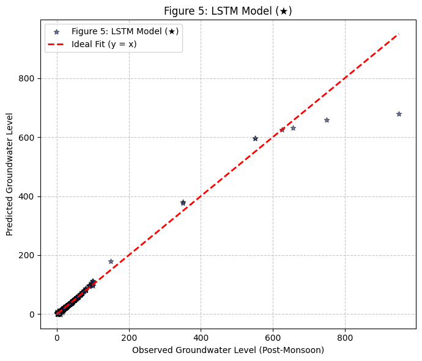
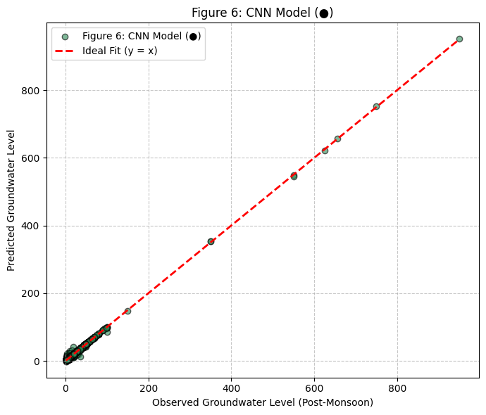
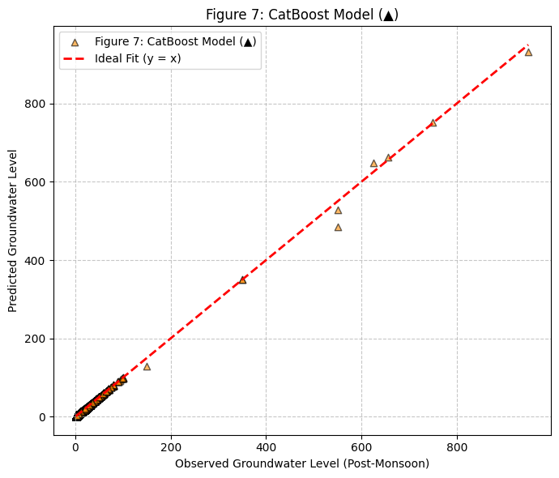
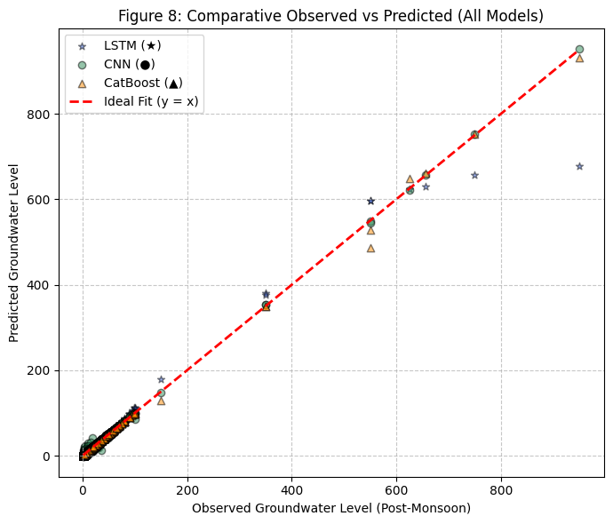

# Groundwater Level Prediction using LSTM, CNN, and CatBoost

A comparative machine learning study for forecasting post-monsoon groundwater levels.  
This project evaluates three models (LSTM, CNN, and CatBoost) on real groundwater data and analyzes how accurately each predicts observed values.

The goal is to support early detection of groundwater stress, improve resource planning, and assist in water-management decisions.

---

## Key Objectives

- Predict groundwater levels for different regions post-monsoon  
- Compare deep learning models (LSTM, CNN) with CatBoost  
- Identify which model is most accurate and stable across all ranges  

---

## Models Used

| Model   | Type                        | Strength                                      |
|--------|-----------------------------|-----------------------------------------------|
| LSTM   | Deep Learning (Sequential)  | Captures long-term temporal dependencies      |
| CNN    | Deep Learning (1D patterns) | Fast training, robust trend detection         |
| CatBoost | Gradient Boosting        | Handles non-linear data, minimal preprocessing|

---

## Project Structure

```text
📁 AI_Based_WaterStress_Detection_(LSTM,CatBoost,CNN)

 ├── AI_Based_WaterStress_Detection_(LSTM,CatBoost,CNN).ipynb
 ├── data/
 │   └── UPVillageSchedule.csv                   # Input dataset
 ├── images/
 │   ├── LSTM.png
 │   ├── CNN.png
 │   ├── CatBoost.png
 │   └── All_Models.png
 ├── README.md
 

```

#### Observed vs Predicted Results

### Figure 5: LSTM Model (★)
<p align="center">
  
</p>

### Figure 6: CNN Model (●)
<p align="center">
  
</p>

### Figure 7: CatBoost Model (▲)
<p align="center">
  
</p>

### Figure 8: Comparative Observed vs Predicted (All Models)
<p align="center">
  
</p>

The red dashed line in each figure represents the ideal fit (y = x).
Points closer to this line indicate more accurate predictions.


## Evaluation Insights

All three models follow the ideal line reasonably well.  
CNN and CatBoost show strong alignment with the ideal fit, especially at higher groundwater levels.  
LSTM performs well but shows slightly higher variance at extreme values.

### In summary:

- For **stability and consistency**, CNN and CatBoost are preferable.  
- For **sequential pattern learning**, LSTM remains useful, especially when trained on more time steps/features.

---

## Tech Stack

**Language:** Python  

**Libraries Used:**

| Purpose | Libraries |
|--------|-----------|
| Data Processing | pandas, numpy |
| Deep Learning | tensorflow, keras |
| Gradient Boosting | catboost |
| Visualization | matplotlib, seaborn |

---

## Setup and Usage

### Step 1: Clone the repository

```bash
git clone https://github.com/Praveen23-kk/AI_Based_WaterStress_Detection_-LSTM-CatBoost-CNN.git
cd AI_Based_WaterStress_Detection_-LSTM-CatBoost-CNN
```

### Step 2: Open the notebook

```bash
jupyter notebook notebooks/AI_Based_WaterStress_Detection_(LSTM,CatBoost,CNN).ipynb
```

Step 4: Run all cells to:

```
Load and preprocess the dataset

Train LSTM, CNN, and CatBoost models

Generate prediction plots inside the images/ folder
```
##Future Work
```
Build an ensemble of LSTM + CNN + CatBoost

Add spatial visualization through GIS mapping

Extend model with rainfall and climate attributes

Deploy using Streamlit 

```
##License

This project is open for research and academic use.
Attribution is appreciated if referenced or used in further work.


